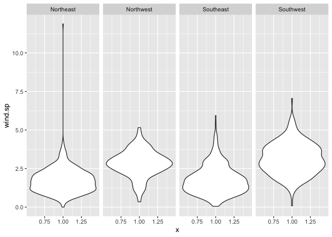
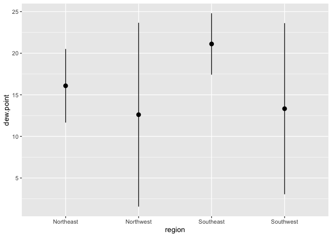
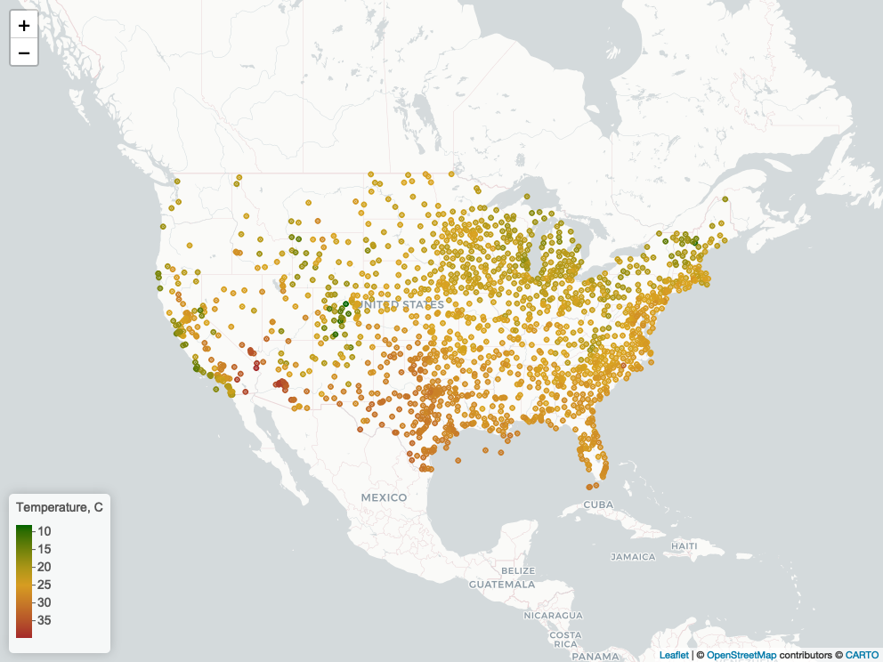

lab 4
================
ks
9/17/2021

## Lab week 4

``` r
library(data.table)
library(tidyverse)
```

    ## ── Attaching packages ─────────────────────────────────────── tidyverse 1.3.1 ──

    ## ✔ ggplot2 3.3.6     ✔ purrr   0.3.4
    ## ✔ tibble  3.1.8     ✔ dplyr   1.0.9
    ## ✔ tidyr   1.2.0     ✔ stringr 1.4.0
    ## ✔ readr   2.1.2     ✔ forcats 0.5.1

    ## ── Conflicts ────────────────────────────────────────── tidyverse_conflicts() ──
    ## ✖ dplyr::between()   masks data.table::between()
    ## ✖ dplyr::filter()    masks stats::filter()
    ## ✖ dplyr::first()     masks data.table::first()
    ## ✖ dplyr::lag()       masks stats::lag()
    ## ✖ dplyr::last()      masks data.table::last()
    ## ✖ purrr::transpose() masks data.table::transpose()

``` r
library(leaflet)
library(htmlwidgets)
library(webshot)
```

### 1. Read in the data

First read the data into a data.table.

``` r
if (!file.exists("~kims/GitHub/pm566-202103-labs/lab03/met_all.gz")) {
download.file("https://raw.githubusercontent.com/USCbiostats/data-science-data/master/02_met/met_all.gz", "met_all.gz", method="libcurl", timeout = 60)
}
met <- data.table::fread("~kims/GitHub/pm566-202103-labs/lab03/met_all.gz")
```

## 2. Prepare the data

``` r
#Remove temperatures less than -17C.
met <- met[temp > -17]

#Make sure there are no missing data in the key variables coded as 9999, 999, etc
#temp, rh, wind.sp, vis.dist, dew.point, lat, lon, and elev.
met[,range(temp,na.rm=T)]
```

    ## [1] -3 56

``` r
met[,range(rh,na.rm=T)]
```

    ## [1]   0.8334298 100.0000000

``` r
met[,range(wind.sp,na.rm=T)]
```

    ## [1]  0 36

``` r
met[,range(vis.dist,na.rm=T)]
```

    ## [1]      0 160000

``` r
met[,range(dew.point,na.rm=T)]
```

    ## [1] -37.2  36.0

``` r
met[,range(lat,na.rm=T)]
```

    ## [1] 24.550 48.941

``` r
met[,range(lon,na.rm=T)]
```

    ## [1] -124.290  -68.313

``` r
met[,range(elev,na.rm=T)]
```

    ## [1]  -13 9999

``` r
met[elev==9999.0, elev:= NA ]

#Generate a date variable using the functions as.Date() (hint: You will need the following to create a date paste(year, month, day, sep = "-")).
met[,ymd := as.Date(paste(year, month, day, sep = "-"))]

#Using the data.table::week function, keep the observations of the first week of the month.
met[,table(week(ymd))]
```

    ## 
    ##     31     32     33     34     35 
    ## 297259 521600 527922 523847 446576

``` r
met <- met[ week(ymd) == 31]
dim(met)
```

    ## [1] 297259     31

``` r
#Compute the mean by station of the variables temp, rh, wind.sp, vis.dist, dew.point, lat, lon, and elev.
met_avg <- met[,.(
   temp      = mean(temp,na.rm=T),
   rh        = mean(rh,na.rm=T),
   wind.sp   = mean(wind.sp,na.rm=T),
   vis.dist  = mean(vis.dist,na.rm=T),
   dew.point = mean(dew.point,na.rm=T),
   lat       = mean(lat,na.rm=T),
   lon       = mean(lon,na.rm=T),
   elev      = mean(elev,na.rm=T)
), by = "USAFID"]
#Create a region variable for NW, SW, NE, SE based on lon = -98.00 and lat = 39.71 degrees
#Create a categorical variable for elevation as in the lecture slides
met_avg[lat >  39.71 & lon <= -98, region := "Northwest"]
met_avg[lat <= 39.71 & lon <= -98, region := "Southwest"]
met_avg[lat > 39.71  & lon > -98,  region:= "Northeast"]
met_avg[lat <=  39.71&  lon > -98, region := "Southeast"]

met_avg[,table(region)]
```

    ## region
    ## Northeast Northwest Southeast Southwest 
    ##       484       146       649       296

``` r
met_avg[,elev_cat := ifelse(elev>252,"high","low")]
```

## 3. Use geom_violin to examine the wind speed and dew point temperature by region

``` r
ggplot(met_avg, mapping = aes(y = wind.sp, x = 1)) +
 geom_violin() +
  facet_grid(~region)
```

    ## Warning: Removed 15 rows containing non-finite values (stat_ydensity).

<!-- -->

## 6. Use stat_summary to examine mean dew point and wind speed by region with standard deviation error bars

Make sure to remove NA

Use fun.data=“mean_sdl” in stat_summary

``` r
p <- met_avg[!is.na(dew.point) ] %>%
  ggplot() + 
    stat_summary(mapping = aes(x = region, y = dew.point),
    fun.data = mean_sdl)
p
```

<!-- -->

Add another layer of stats_summary but change the geom to “errorbar”
(see the help).

Describe the graph and what you observe

Dew point temperature is…

Wind speed is…

## 7. Make a map showing the spatial trend in relative h in the US

``` r
#Make sure to remove NA
#Use leaflet()

#Make a colour palette with custom colours
met_avg2 <- met[,.(temp = mean(temp,na.rm=TRUE), lat = mean(lat), lon = mean(lon)),  by=c("USAFID")]
met_avg2 <- met_avg2[!is.na(temp)]
# Generating a color palette
temp.pal <- colorNumeric(c('darkgreen','goldenrod','brown'), domain=met_avg2$temp)
temp.pal
```

    ## function (x) 
    ## {
    ##     if (length(x) == 0 || all(is.na(x))) {
    ##         return(pf(x))
    ##     }
    ##     if (is.null(rng)) 
    ##         rng <- range(x, na.rm = TRUE)
    ##     rescaled <- scales::rescale(x, from = rng)
    ##     if (any(rescaled < 0 | rescaled > 1, na.rm = TRUE)) 
    ##         warning("Some values were outside the color scale and will be treated as NA")
    ##     if (reverse) {
    ##         rescaled <- 1 - rescaled
    ##     }
    ##     pf(rescaled)
    ## }
    ## <bytecode: 0x7fb05146d548>
    ## <environment: 0x7fb05146fe78>
    ## attr(,"colorType")
    ## [1] "numeric"
    ## attr(,"colorArgs")
    ## attr(,"colorArgs")$na.color
    ## [1] "#808080"

``` r
#Use addMarkers to include the top 10 places in relative h (hint: this will be useful rank(-rh) <= 10)
tempmap <- leaflet(met_avg2) %>% 
  # The looks of the Map
  addProviderTiles('CartoDB.Positron') %>% 
  # Some circles
  addCircles(
    lat = ~lat, lng=~lon,
                                                  # HERE IS OUR PAL!
    label = ~paste0(round(temp,2), ' C'), color = ~ temp.pal(temp),
    opacity = 1, fillOpacity = 1, radius = 500
    ) %>%
  # And alegend
  addLegend('bottomleft', pal=temp.pal, values=met_avg2$temp,
          title='Temperature, C', opacity=1)

#tempmap

## save html to png
saveWidget(tempmap, "leaflet_map.html", selfcontained = FALSE)
webshot("leaflet_map.html", file = "leaflet_map.png",
        cliprect = "viewport")
```

    ## Warning in is.null(x) || is.na(x): 'length(x) = 4 > 1' in coercion to
    ## 'logical(1)'

<!-- -->

``` r
#Describe trend in RH across the US
```
