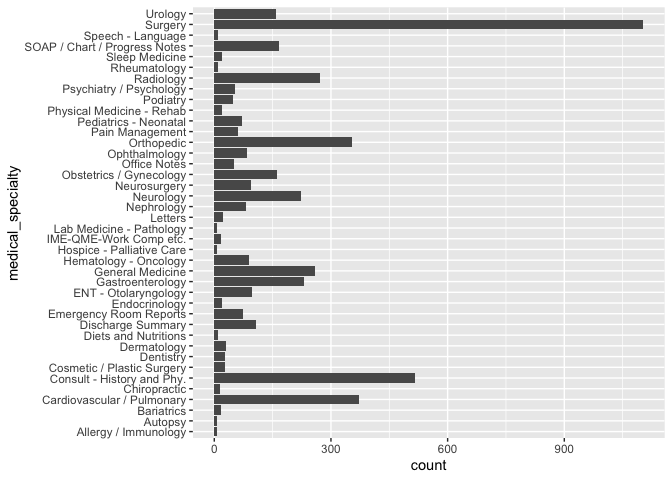

lab 6
================
ks
10/01/2021

## Lab week 6

``` r
library(data.table)
library(ggplot2)
library(dplyr)
```

    ## 
    ## Attaching package: 'dplyr'

    ## The following objects are masked from 'package:data.table':
    ## 
    ##     between, first, last

    ## The following objects are masked from 'package:stats':
    ## 
    ##     filter, lag

    ## The following objects are masked from 'package:base':
    ## 
    ##     intersect, setdiff, setequal, union

``` r
library(tidytext)
library(tidyverse)
```

    ## ── Attaching packages ─────────────────────────────────────── tidyverse 1.3.1 ──

    ## ✓ tibble  3.1.4     ✓ purrr   0.3.4
    ## ✓ tidyr   1.1.3     ✓ stringr 1.4.0
    ## ✓ readr   2.0.1     ✓ forcats 0.5.1

    ## ── Conflicts ────────────────────────────────────────── tidyverse_conflicts() ──
    ## x dplyr::between()   masks data.table::between()
    ## x dplyr::filter()    masks stats::filter()
    ## x dplyr::first()     masks data.table::first()
    ## x dplyr::lag()       masks stats::lag()
    ## x dplyr::last()      masks data.table::last()
    ## x purrr::transpose() masks data.table::transpose()

``` r
fn <- "mtsamples.csv"
if (!file.exists(fn))
  download.file(
    url = "https://raw.githubusercontent.com/USCbiostats/data-science-data/master/00_mtsamples/mtsamples.csv",
    destfile = fn)
mtsamples <- read_csv(fn)
```

    ## New names:
    ## * `` -> ...1

    ## Rows: 4999 Columns: 6

    ## ── Column specification ────────────────────────────────────────────────────────
    ## Delimiter: ","
    ## chr (5): description, medical_specialty, sample_name, transcription, keywords
    ## dbl (1): ...1

    ## 
    ## ℹ Use `spec()` to retrieve the full column specification for this data.
    ## ℹ Specify the column types or set `show_col_types = FALSE` to quiet this message.

``` r
#mtsamples <- as_tibble(fn)
```

Read in Medical Transcriptions Loading in reference transcription
samples from <https://www.mtsamples.com/>

### Question 1. What specialties do we have?

We can use count() from dplyr to figure out how many different
categories do we have? Are these categories related? overlapping? evenly
distributed?

``` r
specialties <- mtsamples %>%
   count(medical_specialty)
```

There are 40 specialties.

``` r
specialties %>%
  arrange(desc(n)) %>%
  top_n(15) %>%
  knitr::kable()
```

    ## Selecting by n

| medical\_specialty            |    n |
|:------------------------------|-----:|
| Surgery                       | 1103 |
| Consult - History and Phy.    |  516 |
| Cardiovascular / Pulmonary    |  372 |
| Orthopedic                    |  355 |
| Radiology                     |  273 |
| General Medicine              |  259 |
| Gastroenterology              |  230 |
| Neurology                     |  223 |
| SOAP / Chart / Progress Notes |  166 |
| Obstetrics / Gynecology       |  160 |
| Urology                       |  158 |
| Discharge Summary             |  108 |
| ENT - Otolaryngology          |   98 |
| Neurosurgery                  |   94 |
| Hematology - Oncology         |   90 |

``` r
ggplot(mtsamples, aes(x = medical_specialty)) +
  geom_histogram(stat = "count") +
  coord_flip()
```

    ## Warning: Ignoring unknown parameters: binwidth, bins, pad

<!-- -->

These are not evenly (uniformly) distributed.

### Question 2. Tokenize the the words in the transcription column

Count the number of times each token appears Visualize the top 20 most
frequent words Explain what we see from this result. Does it makes
sense? What insights (if any) do we get?

``` r
#mtsamples %>%
#  unnest_tokens(token, text)  %>%
#  count(token, sort = TRUE) %>%
##  top_n(20, n)  %>%
#  ggplot(aes(n, fct_reorder(token, n))) +
#  geom_col()
```

### Question 3.

Redo visualization but remove stop words before. Bonus points if you
remove numbers as well. What do we see know that we have removed stop
words? Does it give us a better idea of what the text is about?

``` r
#mtsamples %>%
#  unnest_tokens(word, text) %>%
#  anti_join(stop_words, by = c("word")) %>%
#  count(word, sort = TRUE) %>%
#  top_n(20, n) %>%
#  ggplot(aes(n, fct_reorder(word, n))) +
#  geom_col()
```

### Question 4:

repeat question 2, but this time tokenize into bi-grams. how does the
result change if you look at tri-grams?

``` r
#mtsamples %>%
#  unnest_ngrams(ngram, text, n=2)  %>%
#  count(ngram, sort = TRUE) %>%
#  top_n(20, n)  %>%
#  ggplot(aes(n, fct_reorder(ngram, n))) +
#  geom_col()
```

``` r
#mtsamples %>%
#  unnest_ngrams(ngram, text, n=3)  %>%
#  count(ngram, sort = TRUE) %>%
#  top_n(20, n)  %>%
#  ggplot(aes(n, fct_reorder(ngram, n))) +
#  geom_col()
```

### Question 5.

Use the results you got from question 4. Pick a word and count the words
that appears after and before it.

``` r
#mtsamples %>%
#  unnest_ngrams(ngram, text, n = 2) %>%
#  separate(ngram, into = c("word1", "word2"), sep = " ") %>%
#  select(word1, word2) %>%
##  filter(word2 == "alice") %>%
#  count(word1, sort = TRUE)
```

``` r
#mtsamples %>%
#  unnest_ngrams(ngram, text, n = 2) %>%
#  separate(ngram, into = c("word1", "word2"), sep = " ") %>%
#  select(word1, word2) %>%
#  filter(word1 == "alice") %>%
#  count(word2, sort = TRUE)
```

### Question 6.

Which words are most used in each of the specialties. you can use
group\_by() and top\_n() from dplyr to have the calculations be done
within each specialty. Remember to remove stopwords. How about the most
5 used words?

Knit the document, commit your changes, and Save it on GitHub. Don’t
forget to add README.md to the tree, the first time you render it.

Knit the doc and save it on GitHub.

git commit -a -m “Finalizing lab 5
<https://github.com/USCbiostats/PM566/issues/23>”

``` r
sessionInfo()
```

    ## R version 4.1.0 (2021-05-18)
    ## Platform: x86_64-apple-darwin17.0 (64-bit)
    ## Running under: macOS Mojave 10.14.6
    ## 
    ## Matrix products: default
    ## BLAS:   /Library/Frameworks/R.framework/Versions/4.1/Resources/lib/libRblas.dylib
    ## LAPACK: /Library/Frameworks/R.framework/Versions/4.1/Resources/lib/libRlapack.dylib
    ## 
    ## locale:
    ## [1] en_US.UTF-8/en_US.UTF-8/en_US.UTF-8/C/en_US.UTF-8/en_US.UTF-8
    ## 
    ## attached base packages:
    ## [1] stats     graphics  grDevices utils     datasets  methods   base     
    ## 
    ## other attached packages:
    ##  [1] forcats_0.5.1     stringr_1.4.0     purrr_0.3.4       readr_2.0.1      
    ##  [5] tidyr_1.1.3       tibble_3.1.4      tidyverse_1.3.1   tidytext_0.3.2   
    ##  [9] dplyr_1.0.7       ggplot2_3.3.5     data.table_1.14.0
    ## 
    ## loaded via a namespace (and not attached):
    ##  [1] Rcpp_1.0.7        lubridate_1.7.10  lattice_0.20-44   assertthat_0.2.1 
    ##  [5] digest_0.6.27     utf8_1.2.2        R6_2.5.1          cellranger_1.1.0 
    ##  [9] backports_1.2.1   reprex_2.0.1      evaluate_0.14     httr_1.4.2       
    ## [13] highr_0.9         pillar_1.6.2      rlang_0.4.11      readxl_1.3.1     
    ## [17] rstudioapi_0.13   Matrix_1.3-4      rmarkdown_2.10    labeling_0.4.2   
    ## [21] munsell_0.5.0     broom_0.7.9       compiler_4.1.0    janeaustenr_0.1.5
    ## [25] modelr_0.1.8      xfun_0.25         pkgconfig_2.0.3   htmltools_0.5.2  
    ## [29] tidyselect_1.1.1  fansi_0.5.0       crayon_1.4.1      tzdb_0.1.2       
    ## [33] dbplyr_2.1.1      withr_2.4.2       SnowballC_0.7.0   grid_4.1.0       
    ## [37] jsonlite_1.7.2    gtable_0.3.0      lifecycle_1.0.0   DBI_1.1.1        
    ## [41] magrittr_2.0.1    scales_1.1.1      tokenizers_0.2.1  cli_3.0.1        
    ## [45] stringi_1.7.4     farver_2.1.0      fs_1.5.0          xml2_1.3.2       
    ## [49] ellipsis_0.3.2    generics_0.1.0    vctrs_0.3.8       tools_4.1.0      
    ## [53] glue_1.4.2        hms_1.1.0         fastmap_1.1.0     yaml_2.2.1       
    ## [57] colorspace_2.0-2  rvest_1.0.1       knitr_1.34        haven_2.4.3
